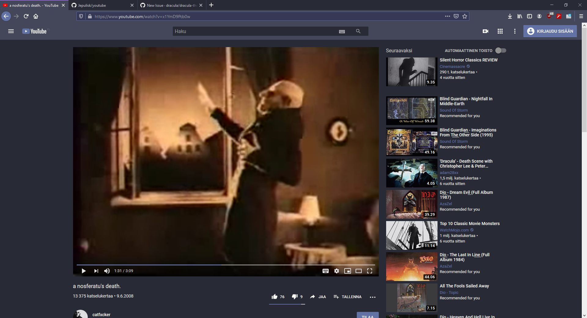

# Dracula for [Youtube](https://www.youtube.com)

> A dark theme for [Youtube](https://www.youtube.com).

## Install

1. Enhancer for Youtube

    Theme -> Custom theme -> copypaste content of dracula.css -> Save

2. Stylus

    New style -> youtube.com as name -> check that Activated is selected -> copypaste content of dracula.css -> Save

## Team

This theme is maintained by the following person(s) and a bunch of [awesome contributors](https://github.com/dracula/template/graphs/contributors).

[Jepulisk](https://github.com/Jepulisk)

## License

[GNU General Public License v3.0](./LICENSE)

## Source

[YouTube-DeepDark by RaitaRoh](https://github.com/RaitaroH/YouTube-DeepDark)
